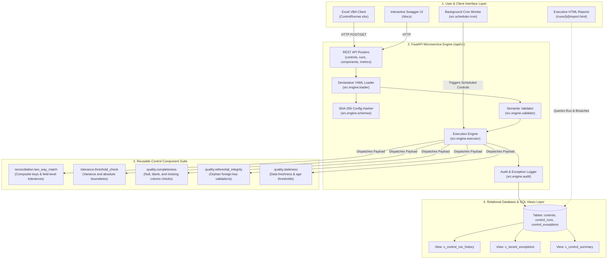

# Control Automation Service — Comprehensive Project Overview & Build Guide

> **Domain:** Financial Data Engineering & Product Control Analytics  
> **Target Role:** Analyst – Data Engineering (Product Control Analytics), HSBC  
> **Repository:** [https://github.com/AmberVats/control-automation-service.git](https://github.com/AmberVats/control-automation-service.git)

---

## 1. Executive Summary & Problem Statement

### The Problem in Investment Banking & Product Control
In top-tier investment banks like HSBC, the **Product Control (PC)** function is responsible for ensuring the integrity of financial statements, daily profit & loss (PnL) attribution, balance sheet substantiation, and risk/position valuation.

Historically, Product Control processes suffer from three major operational bottlenecks:
1. **Manual Spreadsheet Dependency (EUC Risks):** End-User Computing (EUC) spreadsheets are fragile, lack version control, have no audit trails, and cannot scale with millions of trade transactions.
2. **Ad-Hoc, Hardcoded Reconciliations:** Different trading desks create custom Python or SQL scripts for basic two-way matching, creating massive code duplication and technical debt.
3. **Audit & Governance Gaps:** When a control passes in Q1 and fails in Q2, auditors and Independent Model Review (IMR) cannot determine whether the underlying market data changed, the business logic was modified, or the tolerance was tampered with.

### The Solution: `control-automation-service`
This project builds an enterprise-grade **Control Automation Microservice** implementing a **Citizen Developer Framework**:
- **Non-Developer Empowerment:** Business analysts and Product Control teams compose complex financial controls using declarative **YAML configuration files** without writing a single line of Python code.
- **Deterministic Auditability:** Every control definition is versioned and hashed using **SHA-256**. Every execution run persists start/end timestamps, duration in milliseconds, input/output row counts, status (`PASS`, `BREACH`, `FAIL`), and row-level breach records.
- **Microservice Architecture:** FastAPI REST endpoints (`/api/v1/`) allow orchestration engines, schedulers, CI/CD pipelines, and business tools to execute controls on-demand.
- **Excel / VBA Client:** Business users retain their familiar Excel interface (`ControlRunner.xlsx` with clean `.bas` modules) that communicates with the centralized microservice via HTTP, keeping all business logic version-controlled and tested server-side.

---

## 2. System Architecture & High-Level Design

---

## 3. Detailed Build Phases

### Phase 1: Reusable Component Library (`src/components/`)
* **Objective:** Design an extensible, object-oriented hierarchy of control components adhering to the Strategy and Template Method design patterns.
* **Key Deliverables:**
  - `ControlComponent` Base Class: Enforces `name`, `version`, and `execute(data)` interface.
  - `ComponentRegistry`: Central in-memory registry supporting dynamic discovery, catalogue metadata generation, and execution routing.
  - 5 Financial Control Components:
    1. `reconciliation.two_way_match`: Multi-key matching across risk/ledger tables with absolute and relative tolerance.
    2. `tolerance.threshold_check`: Boundary variance comparator.
    3. `quality.completeness`: Mandatory field completeness and null detector.
    4. `quality.referential_integrity`: Foreign key referential validator against reference masters.
    5. `quality.staleness`: Timestamp freshness and pricing staleness analyzer.

### Phase 2: Engine & YAML Configuration Layer (`src/engine/`)
* **Objective:** Allow business analysts to define controls in declarative YAML without writing code.
* **Key Deliverables:**
  - `ControlDefinitionSchema` (Pydantic v2): Validates YAML specifications, data source connections, tolerances, and metadata.
  - Deterministic SHA-256 Hashing: Generates unique 64-character hash of canonical configuration for immutable audit tracking.
  - `load_controls_from_dir`: Automatically parses and registers all YAML control specs from the `controls/` folder.

### Phase 3: Database & SQL Audit Persistence (`src/db/`, `sql/`)
* **Objective:** Store all control definitions, executions, and breach exceptions relationally.
* **Key Deliverables:**
  - SQLAlchemy Models: `ControlModel`, `ControlRunModel`, `ControlExceptionModel`.
  - Relational Schema (`sql/01_schema.sql`): Foreign-key cascaded tables with indexing on `control_name`, `status`, and timestamps.
  - Analytical SQL Views (`sql/02_views.sql`):
    - `v_control_run_history`: Chronological audit logs with execution durations.
    - `v_recent_exceptions`: Top exceptions joined with parent control context.
    - `v_control_summary`: Aggregate pass rate, breach rate, and average latency per control.

### Phase 4: FastAPI REST Microservice (`src/api/`, `src/main.py`)
* **Objective:** Expose all control routines through high-performance RESTful endpoints.
* **Key Deliverables:**
  - `POST /api/v1/controls`: Register / update a control from YAML/JSON.
  - `GET /api/v1/controls`: List registered controls and their active versions.
  - `POST /api/v1/controls/{name}/run`: Execute a control with synchronous or background execution.
  - `GET /api/v1/runs/{run_id}`: Fetch execution summary and duration metrics.
  - `GET /api/v1/runs/{run_id}/exceptions`: Paginated exception rows.
  - `GET /api/v1/components`: Discoverable component catalogue with parameter schemas.
  - `GET /health` & `GET /metrics`: Observability, uptime, and pass-rate metrics.

### Phase 5: Financial Controls & Seed Data (`controls/`, `queries/`, `data/`)
* **Objective:** Provide out-of-the-box financial controls and realistic trading datasets.
* **Key Deliverables:**
  - 5 YAML Controls: EOD position reconciliation, price variance tolerance, trade completeness, trade referential integrity, and market feed staleness.
  - 5 SQL Queries: `risk_positions.sql`, `books_positions.sql`, `trades.sql`, `instruments.sql`, `market_prices.sql`.
  - `seed_demo_data.py`: Creates mock trading database with intentional anomalies (e.g. MSFT position break, missing trade field, orphan instrument ID, stale price).

### Phase 6: Excel / VBA Client Integration (`excel_client/`)
* **Objective:** Bridge modern Python microservices with banking analysts' primary tool (Microsoft Excel).
* **Key Deliverables:**
  - `ControlClient.bas`: VBA module invoking REST API endpoints via `MSXML2.ServerXMLHTTP`.
  - `JsonConverter.bas`: Fast VBA parser decoding JSON arrays and dictionaries into native VBA collections.
  - `SheetFormatter.bas`: Styles output worksheets with HSBC corporate palette.
  - `ControlRunner.xlsx`: Pre-styled spreadsheet containing Control Panel, Exceptions, and Run History sheets.

### Phase 7: HTML Reporting Engine (`src/report/`)
* **Objective:** Provide standalone, executive-ready HTML exception summaries.
* **Key Deliverables:**
  - `render_html_report()`: Generates self-contained HTML reports with status cards, metadata tables, and formatted exception rows.
  - `GET /api/v1/runs/{run_id}/report.html`: Dedicated REST endpoint returning styled HTML reports directly in the browser.
  - Zero external CSS/JS dependencies, ensuring complete rendering inside secure corporate firewalls.

### Phase 8: Containerization, Testing & CI/CD
* **Objective:** Ensure production readiness, test coverage, and automated deployment.
* **Key Deliverables:**
  - Multi-stage `Dockerfile` and `docker-compose.yml` (API, PostgreSQL, Cron Scheduler).
  - 55 Automated Unit, Integration, and End-to-End Tests in `pytest` (100% pass rate, 0 warnings).
  - GitHub Actions CI workflow in `.github/workflows/ci.yml`.

---

## 4. Key Financial Control Implementations

### Control 1: EOD Position & Market Value Two-Way Match
* **File:** `controls/eod_position_break.yaml`
* **Business Logic:** Compares positions between front-office Risk Management System and back-office Books & Records.
* **Tolerances:**
  - `quantity`: Absolute tolerance = 0 (Quantity must roll forward with zero break).
  - `market_value`: Absolute = $50.00, Relative = 0.0001 (1 basis point).

### Control 2: Trade Feed Mandatory Completeness Check
* **File:** `controls/trade_completeness.yaml`
* **Business Logic:** Validates that all trade bookings contain mandatory economic attributes: `trade_id`, `instrument_id`, `book`, `trader`, `side`, `quantity`, `price`, `settle_date`.

### Control 3: Trade Referential Integrity
* **File:** `controls/trade_referential_integrity.yaml`
* **Business Logic:** Prevents orphan trades by asserting that all booked `instrument_id` values exist in the `dim_instruments` security master table.

### Control 4: Market Price Feed Staleness
* **File:** `controls/market_feed_staleness.yaml`
* **Business Logic:** Detects valuation feeds that have not refreshed within the maximum allowed 1 business day threshold.

---

## 5. Interview Talking Points (How to Pitch This Project)

When discussing this project with HSBC interviewers, highlight these key themes:

1. **Why Citizen Developer Framework Matters:**  
   *"Spreadsheet logic is opaque, cannot be unit-tested, and has no audit trail. By moving business logic into a centralized FastAPI microservice and allowing users to configure controls in declarative YAML, we gave business analysts the flexibility of citizen development with the rigor of enterprise software engineering."*
2. **Why Config Hashing Matters for Audit:**  
   *"We compute a deterministic SHA-256 hash of every control specification. If internal audit asks why a control passed in March and failed in July, the config hash proves whether the methodology changed or the market data shifted."*
3. **Decoupled Architecture:**  
   *"The Excel client is completely thin. It contains zero business logic—all reconciliation, tolerance checking, and exception generation happen server-side and are persisted to relational SQL tables."*
