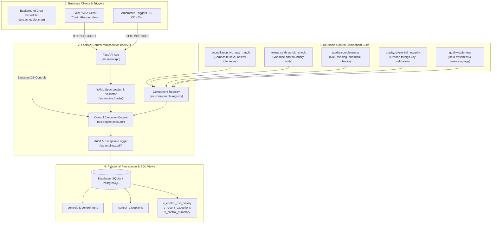

# Control Automation Service

[](https://github.com/AmberVats/control-automation-service/actions/workflows/ci.yml)


> **Enterprise financial control automation microservice** built for **Product Control Analytics**. Exposes declarative reconciliation, tolerance variance, and data quality routines as versioned REST endpoints within a **Citizen Developer framework**, backed by immutable SQL audit trails and an Excel/VBA client for business users.

---

## 🏛️ System Architecture



---

## 🌟 Key Capabilities

1. **Citizen Developer Framework**: Business users and Product Control analysts configure complex financial controls purely through declarative **YAML specifications**—no Python code changes required.
2. **Deterministic Versioning & Config Hashing**: Every control definition is hashed via **SHA-256**. Changes over quarters/years are auditable down to the exact configuration that produced a historical result.
3. **Reusable Component Suite**: Plug-and-play components for 2-way reconciliations, threshold tests, data completeness, foreign-key integrity, and feed staleness.
4. **Enterprise REST API**: Versioned FastAPI endpoints (`/api/v1/controls`, `/api/v1/runs`, `/api/v1/components`, `/metrics`).
5. **VBA / Excel Integration**: Thin Excel `.xlsm` client using `MSXML2.ServerXMLHTTP` and JSON parsing. Business users interact with controls via a familiar spreadsheet interface while all business logic remains centralized, version-controlled, and audited server-side.
6. **Immutable Audit Trail & SQL Views**: Every execution records input/output row counts, execution duration, status (`PASS`, `BREACH`, `FAIL`), and row-level breach records with SQL views (`v_control_run_history`, `v_control_summary`).

---

## 🧩 Reusable Component Catalogue

| Component Name | Category | Description | Key Parameters |
|---|---|---|---|
| `reconciliation.two_way_match` | Reconciliation | 2-way dataset matching across composite keys with absolute and relative field tolerances. | `source`, `target`, `keys`, `compare`, `tolerance` |
| `tolerance.threshold_check` | Tolerance | Compares expected vs actual numerical values within specified tolerance. | `expected`, `actual`, `tolerance` |
| `quality.completeness` | Quality | Detects missing fields, `NULL` values, or empty strings in mandatory attributes. | `data`, `required_fields`, `allow_empty_string` |
| `quality.referential_integrity` | Quality | Verifies that foreign keys in child datasets exist in parent master datasets. | `source`, `lookup`, `foreign_key`, `primary_key` |
| `quality.staleness` | Quality | Validates that feed timestamps or as-of dates do not exceed maximum age thresholds. | `data`, `timestamp_field`, `as_of_date`, `max_age_days` |

---

## 📝 Declarative Control Specification (YAML)

Non-developers create control files in `controls/`:

```yaml
# controls/eod_position_break.yaml
name: eod_position_break
version: 2
component: reconciliation.two_way_match
description: End-of-Day position reconciliation between Risk System and Core Books & Records.
owner: product_control_analytics
schedule: "0 18 * * 1-5"
enabled: true

source:
  type: query_file
  query_file: queries/risk_positions.sql

target:
  type: query_file
  query_file: queries/books_positions.sql

keys:
  - as_of_date
  - instrument_id
  - book

compare:
  - quantity
  - market_value

tolerance:
  quantity:
    absolute: 0.0
  market_value:
    absolute: 50.0
    relative: 0.0001

notify:
  on_breach:
    - pc-analytics-alerts@hsbc.com
```

---

## 🚀 Quickstart Guide (< 2 Minutes)

### 1. Clone & Setup Virtual Environment
```bash
git clone https://github.com/AmberVats/control-automation-service.git
cd control-automation-service

python -m venv .venv
# On Windows:
.venv\Scripts\activate
# On Linux/macOS:
source .venv/bin/activate

pip install -r requirements.txt
```

### 2. Seed Demo Financial Data
```bash
python -m data.seed_demo_data
```

### 3. Run the Microservice
```bash
uvicorn src.main:app --host 0.0.0.0 --port 8000 --reload
```
- Interactive Swagger API Docs: [http://localhost:8000/docs](http://localhost:8000/docs)
- Component Catalogue: [http://localhost:8000/api/v1/components](http://localhost:8000/api/v1/components)
- Health Check: [http://localhost:8000/health](http://localhost:8000/health)

---

## 📡 REST API Reference

### 1. Register / Update a Control
```bash
curl -X POST http://localhost:8000/api/v1/controls \
  -H "Content-Type: application/json" \
  -d '{"yaml_content": "name: price_check\nversion: 1\ncomponent: tolerance.threshold_check\nparameters:\n  expected: 100\n  actual: 105\n  tolerance: 2"}'
```

### 2. List Registered Controls
```bash
curl -X GET http://localhost:8000/api/v1/controls
```

### 3. Execute a Control
```bash
curl -X POST http://localhost:8000/api/v1/controls/eod_position_break/run \
  -H "Content-Type: application/json" \
  -d '{"as_of_date": "2026-08-15", "triggered_by": "manual_trigger"}'
```

### 4. Fetch Run Exceptions
```bash
curl -X GET http://localhost:8000/api/v1/runs/{run_id}/exceptions?limit=50
```

### 5. Service Observability Metrics
```bash
curl -X GET http://localhost:8000/metrics
```

---

## 📊 Excel / VBA Client (`excel_client/`)

The repository includes a ready-to-use Excel client interface (`excel_client/ControlRunner.xlsx`) and exported `.bas` modules in `excel_client/modules/`:

- `ControlClient.bas`: Handles asynchronous HTTP calls to `/api/v1/controls` and `/api/v1/runs`.
- `JsonConverter.bas`: Native VBA parser for JSON arrays and nested dictionaries.
- `SheetFormatter.bas`: Styles exception and history sheets in HSBC Product Control formatting.

---

## 🗄️ SQL Audit Views & Relational Schema

```sql
-- 1. View full run history with latency and breach metrics
SELECT * FROM v_control_run_history WHERE status = 'BREACH';

-- 2. View recent exception breaches with parent control context
SELECT * FROM v_recent_exceptions LIMIT 20;

-- 3. View aggregate performance summary across all controls
SELECT * FROM v_control_summary;
```

---

## 🐳 Docker Deployment

```bash
# Start microservice, PostgreSQL, and background scheduler
docker-compose up -d --build
```

---

## 🧪 Testing

The test suite contains **53 comprehensive unit, integration, and end-to-end tests**:

```bash
pytest -v
```

```
============================= test session starts =============================
tests/test_component_base.py ....                                        [ 10%]
tests/test_config.py ....                                                [ 18%]
tests/test_tolerance.py ..                                               [ 22%]
tests/test_two_way_match.py ...                                          [ 28%]
tests/test_quality.py .........                                          [ 45%]
tests/test_registry.py ..........                                        [ 64%]
tests/test_loader.py .....                                               [ 73%]
tests/test_audit.py ..                                                   [ 77%]
tests/test_api.py ....                                                   [ 84%]
tests/test_scheduler.py .                                                [ 86%]
tests/test_end_to_end.py ...                                             [100%]
======================= 53 passed in 1.17s =======================
```

---

## 📄 License
MIT License. Developed for HSBC Product Control Analytics Data Engineering.
